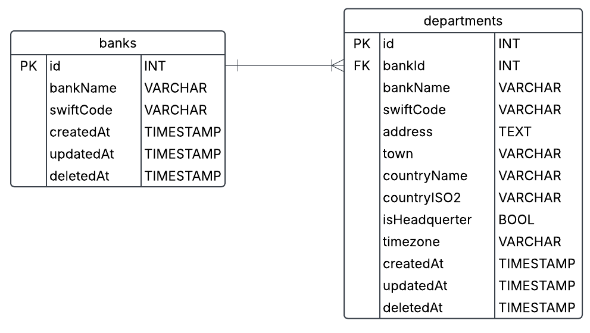

# SWIFT Codes API

## Overview
The `SWIFT Codes API` provides a simple and efficient way to retrieve and manage SWIFT codes for financial institutions. It allows users to search for SWIFT codes by bank name, country, and other criteria, making it easier to process international transactions. It was done based on the file provided: [SWIFT Codes Data File](/src/data/Interns_2025_SWIFT_CODES.csv)

### Getting Started

To set up and use the `SWIFT Codes API`, follow these steps:

### Prerequisites
- Ensure you have the [Docker Compose](https://docs.docker.com/compose/) installed in order to run multiple-container applications

### Installation
1. Clone the repository:
    ```sh
    git clone https://github.com/wotorr3s/swift-codes-api.git
    ```
2. Navigate to the project directory:
    ```sh
    cd swift-codes-api
    ```
3. Build the Docker image:
    ```sh
    docker compose build
    ```

### Running the API
1. Run the container with application (both database and the app itself):
    ```sh
    docker compose up
    ```
2. The API will be running at `http://localhost:8080`.

### Testing the API
1. To test whether everything went well, one can access the base route of the API via `http://localhost:8080`, which should return "Hello World!"
2. To run the unit tests, use the follwing command in the Docker Environment
    ```sh
    npm run test
    ```
3. Each endpoint in the api is tested at least two times, one for correctness of the resulting data and one for the validation of the provided parameters of the request.

### Using the API
You can use tools like [Postman](https://www.postman.com/) or [curl](https://curl.se/) to interact with the API endpoints. One can also use the browser to manually modify request and get the responses (not recommended).

### Example Request
To retrieve information using SWIFT Code:
```sh
curl -X GET "http://localhost:8080/v1/swift-codes/AAISALTRXXX"
```
This should return:
```json
{
  "address": "HYRJA 3 RR. DRITAN HOXHA ND. 11 TIRANA, TIRANA, 1023",
  "bankName": "UNITED BANK OF ALBANIA SH.A",
  "countryISO2": "AL",
  "countryName": "ALBANIA",
  "isHeadquerter": true,
  "swiftCode": "AAISALTRXXX",
  "branches": [
    {
      "address": "HYRJA 3 RR. DRITAN HOXHA ND. 11 TIRANA, TIRANA, 1023",
      "bankName": "UNITED BANK OF ALBANIA SH.A",
      "countryISO2": "AL",
      "isHeadquerter": true,
      "swiftCode": "AAISALTRXXX"
    }
  ]
}
```

### Endpoints
#### GET endpoints
1. **GET** `http://localhost:8080/v1/swift-codes/{swift-code}` - retrieving data about headquerters/departments using their SWIFT code

2. **GET** `http://localhost:8080/v1/swift-codes/country/{countryISO2code}` - retrieving data about headquerters/departments using their countryISO2code

#### POST endpoints
1. **POST** `http://localhost:8080/v1/swift-codes` - adding a new headquerter/department

#### DELETE endpoints
1. **DELETE** `http://localhost:8080/v1/swift-codes/{swiftCode}` - deleting a headquerter/department by the SWIFT code

<!-- #### GET /endpoint
Description of the GET endpoint.

#### POST /endpoint
Description of the POST endpoint. -->

## Error Handling
Information on how errors are handled by the API.

## Tech Stack
This project utilizes the following technologies:

<svg width="50" height="50" viewBox="0 0 100 100" fill="none" xmlns="http://www.w3.org/2000/svg">
<g id="nodejs">
<g id="nodejs_2">
<path id="Vector" d="M46.2785 1.06735C48.758 -0.351924 51.9876 -0.358335 54.465 1.06735C66.9286 8.10993 79.3961 15.1415 91.8576 22.1883C94.2014 23.5086 95.7692 26.1171 95.7454 28.8178V71.1886C95.7628 74.0012 94.0401 76.672 91.5673 77.9623C79.1447 84.9661 66.7285 91.9784 54.308 98.9821C51.7772 100.429 48.4827 100.318 46.031 98.7521C42.3067 96.5931 38.576 94.4447 34.8513 92.2879C34.0902 91.8341 33.2322 91.473 32.6948 90.735C33.1699 90.0947 34.0193 90.0149 34.7096 89.7353C36.2642 89.241 37.692 88.4475 39.1202 87.6775C39.4813 87.4303 39.9222 87.525 40.2684 87.7462C43.4531 89.5722 46.6097 91.4513 49.8051 93.2598C50.4868 93.6534 51.177 93.1309 51.7597 92.8061C63.9501 85.9163 76.1555 79.0525 88.3438 72.1606C88.7954 71.9433 89.0451 71.4639 89.0084 70.9692C89.0169 56.992 89.0105 43.0123 89.0126 29.035C89.0643 28.4737 88.7395 27.9576 88.232 27.7279C75.8524 20.7562 63.4793 13.7738 51.1019 6.80035C50.8874 6.65292 50.6334 6.57382 50.3732 6.57344C50.1129 6.57306 49.8587 6.65141 49.6438 6.79821C37.2664 13.7738 24.8954 20.7626 12.518 27.734C12.0123 27.9641 11.6728 28.4716 11.733 29.035C11.7352 43.0123 11.733 56.992 11.733 70.9714C11.7116 71.2127 11.7646 71.4549 11.8849 71.6652C12.0053 71.8756 12.1872 72.044 12.4062 72.1478C15.7091 74.0208 19.0164 75.8806 22.3215 77.7472C24.1834 78.7494 26.4696 79.3449 28.521 78.577C30.3314 77.9278 31.6003 76.0804 31.5658 74.1582C31.5829 60.2626 31.5573 46.3647 31.5786 32.4712C31.5334 31.8543 32.1185 31.3447 32.7183 31.4027C34.3053 31.392 35.8945 31.3814 37.4815 31.407C38.144 31.392 38.5998 32.0563 38.5179 32.6778C38.5115 46.6614 38.535 60.6454 38.5072 74.6291C38.5115 78.3559 36.9804 82.411 33.5332 84.2345C29.2864 86.4345 24.0374 85.9679 19.8419 83.8584C16.2099 82.0456 12.7438 79.9062 9.17621 77.9641C6.69702 76.6809 4.98286 73.9994 5.00031 71.189V28.8178C4.97431 26.0611 6.60442 23.4053 9.02128 22.1043C21.4418 15.0948 33.8601 8.08001 46.2785 1.06735Z" fill="#8CC84B"/>
<path id="Vector_2" d="M57.1141 30.4179C62.5312 30.0692 68.3304 30.2113 73.2051 32.88C76.9793 34.925 79.0717 39.217 79.1383 43.41C79.0329 43.9756 78.4416 44.2876 77.9017 44.2488C76.33 44.2466 74.7579 44.2701 73.1862 44.2381C72.5195 44.2637 72.132 43.649 72.0483 43.0596C71.5967 41.0534 70.5026 39.0664 68.6143 38.0987C65.7156 36.6474 62.3545 36.7204 59.1937 36.7507C56.8862 36.8732 54.4048 37.073 52.4499 38.4299C50.9491 39.4578 50.4932 41.5327 51.0289 43.2038C51.5339 44.4037 52.919 44.7908 54.0522 45.1477C60.5805 46.8551 67.4985 46.6852 73.9021 48.9322C76.5533 49.8482 79.1468 51.629 80.0543 54.4048C81.2414 58.1252 80.721 62.5721 78.0741 65.5589C75.9276 68.0167 72.8012 69.3544 69.6831 70.0809C65.535 71.0059 61.2302 71.0294 57.0176 70.6187C53.0564 70.1671 48.9343 69.1264 45.8764 66.4275C43.2615 64.157 41.9843 60.6194 42.1111 57.2049C42.1414 56.6283 42.7155 56.2262 43.2679 56.2736C44.8507 56.2608 46.4334 56.2565 48.0162 56.2757C48.6483 56.2305 49.117 56.7768 49.1494 57.3727C49.4415 59.2841 50.1598 61.2903 51.8266 62.4236C55.0434 64.4989 59.0797 64.3568 62.7631 64.4149C65.8146 64.2795 69.2401 64.2386 71.7303 62.2217C73.0441 61.0713 73.4334 59.1467 73.0783 57.4909C72.6937 56.093 71.2313 55.4416 69.9755 55.0156C63.5309 52.977 56.5357 53.7167 50.1534 51.4114C47.5624 50.4957 45.0569 48.7644 44.0614 46.1025C42.6724 42.3351 43.3089 37.6752 46.2333 34.7893C49.0846 31.9187 53.2007 30.8132 57.1141 30.4175V30.4179Z" fill="#8CC84B"/>
</g>
</g>
</svg>
<svg width="50" height="50" viewBox="0 0 100 100" fill="none" xmlns="http://www.w3.org/2000/svg">
<g id="typescript">
<g id="typescript_2">
<path id="Vector" d="M0 0.000488281H100V100H0V0.000488281Z" fill="#017ACB"/>
<path id="Vector_2" d="M48.0157 37.0317H52.8126V45.313H39.8438V82.1567L39.5 82.2505C39.0313 82.3755 32.8594 82.3755 31.5313 82.2349L30.4688 82.1411V45.313H17.5V37.0317L21.6094 36.9849C23.8594 36.9536 29.6406 36.9536 34.4532 36.9849C39.2657 37.0161 45.3594 37.0317 48.0157 37.0317ZM84.6251 78.2505C82.7189 80.2661 80.672 81.3911 77.2657 82.313C75.7813 82.7192 75.5313 82.7349 72.1876 82.7192C68.8438 82.7036 68.5782 82.7036 66.9532 82.2817C62.7501 81.2036 59.3594 79.0942 57.0469 76.1099C56.3907 75.2661 55.3126 73.5161 55.3126 73.2974C55.3126 73.2349 55.4688 73.0942 55.6719 73.0005C55.8751 72.9067 56.2969 72.6411 56.6407 72.438C56.9844 72.2349 57.6094 71.8599 58.0313 71.6411C58.4532 71.4224 59.6719 70.7036 60.7345 70.063C61.797 69.4224 62.7657 68.9067 62.8751 68.9067C62.9845 68.9067 63.1876 69.1255 63.3438 69.3911C64.2813 70.9692 66.4688 72.9849 68.0157 73.6724C68.9688 74.0786 71.0782 74.5317 72.0938 74.5317C73.0313 74.5317 74.7501 74.1255 75.672 73.7036C76.6563 73.2505 77.1564 72.7974 77.7501 71.8911C78.1564 71.2505 78.2032 71.0786 78.1876 69.8599C78.1876 68.7349 78.1251 68.4224 77.8126 67.9067C76.9376 66.4692 75.7501 65.7192 70.9376 63.5942C65.9688 61.3911 63.7345 60.0786 61.9219 58.313C60.5782 57.0005 60.3126 56.6411 59.4688 55.0005C58.3751 52.8911 58.2344 52.2036 58.2188 49.063C58.2032 46.8599 58.2501 46.1411 58.4844 45.3911C58.8126 44.2661 59.8751 42.0942 60.3594 41.5474C61.3594 40.3755 61.7188 40.0161 62.422 39.438C64.547 37.688 67.8595 36.5317 71.0313 36.4224C71.3907 36.4224 72.5782 36.4849 73.6876 36.563C76.8751 36.8286 79.047 37.6099 81.1407 39.2817C82.7189 40.5317 85.1095 43.4692 84.8751 43.8599C84.7189 44.0942 78.4845 48.2505 78.0782 48.3755C77.8282 48.4536 77.6564 48.3599 77.3126 47.9536C75.1876 45.4067 74.3282 44.8599 72.2657 44.7349C70.797 44.6411 70.0157 44.813 69.0313 45.4692C68.0001 46.1567 67.5001 47.2036 67.5001 48.6567C67.5157 50.7817 68.3282 51.7817 71.3282 53.2661C73.2657 54.2192 74.922 55.0005 75.047 55.0005C75.2345 55.0005 79.2501 57.0005 80.297 57.6255C85.172 60.4849 87.1564 63.4224 87.672 68.4849C88.047 72.2974 86.9689 75.7817 84.6251 78.2505Z" fill="white"/>
</g>
</g>
</svg>
<svg width="50" height="50" viewBox="0 0 100 100" fill="none" xmlns="http://www.w3.org/2000/svg">
<g id="postgresql">
<g id="postgresql_2">
<path id="Vector" d="M98.4716 59.9027C97.8902 58.137 96.3673 56.9072 94.3978 56.6121C93.4691 56.4731 92.4055 56.5323 91.1469 56.7925C88.9532 57.2464 87.3257 57.4192 86.138 57.4526C90.6212 49.8623 94.2667 41.2068 96.3654 33.059C99.759 19.8842 97.9455 13.8823 95.8264 11.1675C90.2183 3.98172 82.0361 0.121465 72.1652 0.00334804C66.8994 -0.0612175 62.2768 0.981325 59.8653 1.73104C57.62 1.33378 55.2059 1.11198 52.6728 1.07096C47.9244 0.994998 43.729 2.03298 40.1442 4.1663C38.1595 3.4933 34.9742 2.54457 31.2958 1.93917C22.6444 0.514935 15.6716 1.6247 10.5714 5.23771C4.3955 9.61221 1.53253 17.2127 2.06202 27.828C2.23018 31.1984 4.1103 41.4529 7.0706 51.178C8.77195 56.7678 10.5862 61.4097 12.4629 64.976C15.1243 70.033 17.9722 73.011 21.1692 74.0805C22.961 74.679 26.2168 75.0983 29.6411 72.2385C30.0751 72.7656 30.6542 73.2894 31.4227 73.7759C32.3987 74.3931 33.5922 74.8974 34.7841 75.1963C39.0795 76.273 43.1029 76.0038 46.5356 74.4945C46.5568 75.1067 46.573 75.6916 46.5867 76.1967C46.6094 77.0159 46.6321 77.8192 46.6621 78.5704C46.8654 83.6498 47.2101 87.5994 48.2312 90.3628C48.2873 90.5147 48.3626 90.7464 48.4422 90.9921C48.9516 92.5561 49.8034 95.1744 51.9706 97.2249C54.2147 99.3491 56.9292 100 59.4153 100C60.6622 100 61.8518 99.8364 62.8953 99.6123C66.6146 98.8129 70.8388 97.5952 73.8945 93.2321C76.7836 89.1075 78.188 82.8952 78.4422 73.1067C78.4751 72.8298 78.5054 72.5655 78.5346 72.3137L78.5952 71.7964L79.2758 71.8564L79.4512 71.8682C83.2394 72.0414 87.8715 71.2358 90.7163 69.9107C92.9642 68.8647 100.168 65.0512 98.4716 59.9027Z" fill="black"/>
<path id="Vector_2" d="M91.9943 60.9039C80.7303 63.234 79.9558 59.4098 79.9558 59.4098C91.8485 41.7139 96.8204 19.2515 92.5303 13.7539C80.8254 -1.24237 60.5641 5.84997 60.2259 6.0338L60.1172 6.05354C57.8917 5.59019 55.4014 5.31446 52.6021 5.2685C47.5056 5.18495 43.6393 6.60843 40.7055 8.83936C40.7055 8.83936 4.56141 -6.092 6.24268 27.6181C6.60022 34.7894 16.4932 81.8809 28.2927 67.6571C32.6056 62.4558 36.773 58.0581 36.773 58.0581C38.8424 59.4367 41.3202 60.1401 43.9177 59.8876L44.1196 59.7159C44.0567 60.3615 44.0855 60.9931 44.2002 61.741C41.1604 65.1466 42.0539 65.7444 35.9772 66.9989C29.8282 68.2697 33.4403 70.5318 35.7988 71.1235C38.658 71.8402 45.2725 72.8557 49.7417 66.5819L49.5637 67.2978C50.7545 68.2545 51.5908 73.52 51.4507 78.2937C51.3105 83.067 51.217 86.3443 52.1551 88.9041C53.0941 91.4639 54.0292 97.2236 62.0178 95.5072C68.6925 94.0728 72.1516 90.3557 72.633 84.1551C72.9743 79.7472 73.7473 80.3989 73.7958 76.4577L74.4158 74.5922C75.1305 68.6168 74.5294 66.689 78.6415 67.5857L79.6414 67.6738C82.6676 67.8117 86.6293 67.1854 88.9545 66.1018C93.9608 63.7721 96.9302 59.8819 91.9936 60.9039H91.9943Z" fill="#336791"/>
<path id="Vector_3" d="M42.8212 30.8251C41.8062 30.6834 40.8869 30.8144 40.4218 31.1676C40.1605 31.3663 40.0794 31.5964 40.0575 31.7548C39.9991 32.1745 40.2923 32.6386 40.4726 32.8779C40.9824 33.5554 41.727 34.021 42.4641 34.1236C42.5709 34.1388 42.6773 34.1456 42.783 34.1456C44.012 34.1456 45.1297 33.1859 45.2282 32.4775C45.3513 31.5903 44.0669 30.999 42.8212 30.8254V30.8251ZM76.4482 30.8532C76.3512 30.1578 75.1172 29.9595 73.9461 30.1228C72.7766 30.2861 71.6426 30.8156 71.7373 31.5125C71.813 32.0545 72.789 32.9796 73.9442 32.9796C74.042 32.9796 74.1404 32.9732 74.2397 32.9591C75.0108 32.852 75.5766 32.361 75.8456 32.078C76.2546 31.6466 76.4917 31.1657 76.4482 30.8532Z" fill="white"/>
<path id="Vector_4" d="M95.7425 60.6392C95.313 59.3368 93.9306 58.9179 91.6339 59.3934C84.8145 60.8048 82.3723 59.8272 81.5705 59.2351C86.8711 51.1378 91.2316 41.3496 93.584 32.2174C94.6983 27.8915 95.3138 23.874 95.3642 20.5994C95.4198 17.0053 94.8093 14.3642 93.5503 12.7508C88.4743 6.2468 81.0243 2.75798 72.0063 2.66227C65.8065 2.59238 60.5684 4.18336 59.5529 4.63076C57.4145 4.09752 55.0833 3.77014 52.5453 3.72836C47.8912 3.65278 43.8681 4.77014 40.5374 7.04779C39.0906 6.50772 35.3515 5.22058 30.7789 4.48188C22.8736 3.20576 16.5917 4.17272 12.1088 7.35733C6.75968 11.1576 4.29022 17.9506 4.76858 27.5474C4.92955 30.776 6.76422 40.7085 9.65939 50.2206C13.4704 62.7402 17.6131 69.8276 21.9718 71.2857C22.482 71.4562 23.0702 71.5755 23.719 71.5755C25.309 71.5755 27.2584 70.8569 29.2866 68.4117C31.7604 65.4359 34.3195 62.5322 36.9605 59.7045C38.6739 60.6266 40.5563 61.1416 42.4815 61.1933C42.4853 61.2438 42.4902 61.2943 42.4948 61.3445C42.1634 61.7407 41.8389 62.1427 41.5214 62.5503C40.1874 64.2484 39.9098 64.602 35.6159 65.4884C34.3944 65.7414 31.1504 66.4117 31.1027 68.692C31.0512 71.1835 34.9376 72.2299 35.3803 72.3408C36.9234 72.7281 38.41 72.9192 39.8276 72.9192C43.2754 72.9192 46.3096 71.7828 48.7343 69.5842C48.6597 78.4661 49.029 87.2182 50.0925 89.8848C50.9636 92.0678 53.0915 97.4028 59.8128 97.4025C60.799 97.4025 61.8845 97.2874 63.0787 97.0307C70.0936 95.5229 73.1399 92.4138 74.3181 85.5596C74.9488 81.8965 76.0309 73.1493 76.5399 68.4573C77.614 68.7934 78.9968 68.9473 80.4918 68.9469C83.6097 68.9469 87.2074 68.2826 89.4636 67.2325C91.9982 66.0521 96.572 63.1557 95.7425 60.6392ZM79.0374 28.9336C79.0143 30.3188 78.8241 31.5763 78.6227 32.8889C78.4056 34.3006 78.1814 35.7601 78.125 37.5319C78.0693 39.2562 78.284 41.0488 78.4916 42.7826C78.9113 46.2843 79.3419 49.8894 77.675 53.4466C77.3981 52.9546 77.1515 52.4461 76.9365 51.924C76.7293 51.4203 76.2793 50.6114 75.6563 49.4917C73.2327 45.1332 67.5571 34.9265 70.4625 30.7616C71.3279 29.522 73.5243 28.2474 79.0374 28.9336ZM72.3547 5.46707C80.435 5.64596 86.8268 8.67713 91.3521 14.4759C94.8229 18.9237 91.001 39.162 79.9365 56.6217C79.8253 56.4798 79.7134 56.3384 79.601 56.1974L79.4608 56.022C82.32 51.287 81.761 46.6022 81.2633 42.4488C81.0588 40.7442 80.8656 39.1343 80.9148 37.6219C80.9656 36.0192 81.1769 34.6443 81.3815 33.315C81.6326 31.6769 81.8882 29.9819 81.8178 27.9838C81.8704 27.7741 81.8916 27.5265 81.864 27.2325C81.6841 25.3165 79.5025 19.5819 75.056 14.3916C72.6236 11.5526 69.0766 8.37557 64.2335 6.23275C66.3167 5.79978 69.1653 5.39605 72.3547 5.46707ZM27.1402 66.6221C24.9056 69.3164 23.3626 68.7999 22.8551 68.6305C19.5486 67.5245 15.7118 60.5165 12.3292 49.4036C9.40222 39.7879 7.69178 30.1186 7.55619 27.4072C7.12896 18.8322 9.20186 12.856 13.7177 9.64447C21.067 4.41845 33.1499 7.54647 38.0051 9.13288C37.9354 9.20201 37.8627 9.26657 37.7937 9.33683C29.8263 17.4053 30.0153 31.1904 30.035 32.0332C30.0343 32.3583 30.0615 32.8186 30.0987 33.4517C30.2358 35.7704 30.491 40.0857 29.8093 44.9725C29.176 49.5138 30.5721 53.9585 33.6388 57.1674C33.9536 57.4961 34.2844 57.809 34.63 58.1048C33.265 59.5708 30.2983 62.8128 27.1402 66.6221ZM35.6542 55.2309C33.1824 52.6444 32.0598 49.047 32.5738 45.3599C33.2934 40.1977 33.0279 35.7016 32.8851 33.2861C32.8651 32.9481 32.8472 32.6519 32.837 32.4183C34.0009 31.3833 39.3947 28.4855 43.2413 29.3693C44.9964 29.7722 46.066 30.9709 46.5107 33.0324C48.812 43.7059 46.8152 48.1545 45.2108 51.7295C44.8801 52.4659 44.5677 53.1621 44.301 53.8822L44.0942 54.439C43.5708 55.8465 43.0837 57.1553 42.7819 58.398C40.1541 58.3904 37.5979 57.2647 35.6542 55.2305V55.2309ZM36.0575 69.6252C35.2902 69.433 34.6001 69.0992 34.1952 68.8223C34.5334 68.6628 35.1353 68.4455 36.1791 68.2298C41.2305 67.1873 42.0107 66.4512 43.7144 64.2822C44.1048 63.7847 44.5476 63.221 45.1608 62.5344L45.1616 62.5336C46.0747 61.5082 46.4925 61.6821 47.25 61.9973C47.8639 62.2518 48.462 63.0235 48.7044 63.8728C48.8192 64.2738 48.9479 65.035 48.5264 65.6274C44.9676 70.6241 39.7818 70.5599 36.0575 69.6252ZM62.4939 94.2938C56.3142 95.6216 54.1262 92.4598 52.6843 88.8452C51.7537 86.5118 51.2962 75.9891 51.6208 64.3684C51.6249 64.2138 51.603 64.0646 51.5605 63.924C51.5226 63.6466 51.4649 63.3721 51.3878 63.1029C50.9053 61.4121 49.7293 59.9977 48.3184 59.4113C47.7579 59.1785 46.7292 58.7512 45.493 59.0683C45.7566 57.9791 46.2137 56.7489 46.7095 55.417L46.9174 54.8568C47.1515 54.2251 47.4454 53.5708 47.756 52.878C49.435 49.1378 51.7344 44.0147 49.2388 32.4411C48.3041 28.1061 45.1824 25.9891 40.4503 26.4809C37.6134 26.7753 35.0179 27.923 33.7233 28.5812C33.4449 28.7225 33.1904 28.8592 32.9525 28.9921C33.3139 24.6245 34.6789 16.4618 39.7852 11.2974C43.0004 8.04628 47.2822 6.4405 52.4991 6.52709C62.7784 6.69572 69.3702 11.9855 73.0902 16.3939C76.296 20.1922 78.0318 24.0187 78.7245 26.0825C73.5148 25.5512 69.9716 26.5823 68.1756 29.1573C64.268 34.7586 70.3132 45.6299 73.2186 50.8548C73.7515 51.8123 74.2113 52.6399 74.356 52.9916C75.3021 55.2909 76.527 56.826 77.4212 57.9464C77.6955 58.2897 77.9613 58.6228 78.1636 58.9137C76.5857 59.3699 73.7515 60.4238 74.0098 65.692C73.8015 68.3354 72.3202 80.7115 71.5677 85.0841C70.5742 90.8608 68.4543 93.0124 62.4939 94.2942V94.2938ZM88.2884 64.6939C86.6749 65.4448 83.9748 66.008 81.4099 66.1292C78.5768 66.2621 77.1345 65.8109 76.7952 65.5332C76.6361 62.2503 77.8545 61.9073 79.1442 61.5442C79.3468 61.4873 79.5445 61.4314 79.7354 61.3646C79.854 61.4614 79.9839 61.5575 80.1263 61.6517C82.4033 63.1588 86.4647 63.3213 92.1986 62.1344L92.2615 62.1219C91.488 62.8469 90.1647 63.82 88.2884 64.6939Z" fill="white"/>
</g>
</g>
</svg>
<svg width="50" height="50" viewBox="0 0 100 100" fill="none" xmlns="http://www.w3.org/2000/svg">
<g id="jest">
<g id="jest_2">
<path id="Vector" d="M89.8776 49.2363C89.8776 44.0958 85.7101 39.9284 80.5697 39.9284C80.2388 39.9284 79.9128 39.9461 79.5911 39.9801L92.3755 2.2738H38.0461L50.8128 39.9472C50.6244 39.9353 50.4357 39.9291 50.247 39.9287C45.1066 39.9287 40.9391 44.0955 40.9391 49.2366C40.9391 53.3917 43.6624 56.9097 47.4206 58.1066C45.4357 61.5448 42.9378 64.6419 40.1019 67.3177C36.2455 70.9555 31.8321 73.7142 27.0588 75.4138C21.3756 72.4943 18.692 66.0014 21.1134 60.3086C21.3869 59.6655 21.6661 59.014 21.9329 58.3652C26.05 57.4043 29.1184 53.7134 29.1184 49.3032C29.1184 44.1624 24.951 39.9953 19.8102 39.9953C14.6694 39.9953 10.5023 44.1624 10.5023 49.3032C10.5023 52.4556 12.0705 55.2401 14.4682 56.9238C12.1644 62.1691 8.77785 67.6589 7.7227 74.0214C6.45814 81.6462 7.71845 89.7402 14.3133 94.3113C29.6722 104.956 46.3442 87.7121 63.9225 83.3771C70.2931 81.8064 77.2862 82.0594 82.899 78.8089C87.1139 76.3676 89.8928 72.3217 90.6812 67.7797C91.4607 63.2927 90.3247 58.8251 87.7127 55.2026C89.114 53.5306 89.8806 51.4178 89.8776 49.2363Z" fill="#99425B"/>
<path id="Vector_2" d="M88.4415 67.3907C87.757 71.3342 85.3214 74.7785 81.7598 76.8417C78.4395 78.7646 74.4609 79.3386 70.2481 79.9459C67.9914 80.2711 65.6579 80.6081 63.3782 81.17C57.3506 82.6564 51.5122 85.5564 45.8665 88.3609C34.5674 93.9732 24.8095 98.8196 15.6087 92.4426C8.86887 87.7716 9.17996 79.1292 9.96512 74.3934C10.6929 70.0055 12.6604 65.9645 14.5627 62.0568C14.8868 61.3927 15.2083 60.7272 15.5272 60.0606C16.4861 60.4439 17.4923 60.6963 18.5187 60.811C16.582 67.2025 19.6277 74.1521 26.0199 77.4359L26.895 77.8855L27.8212 77.5556C32.8748 75.7557 37.5316 72.868 41.6619 68.9709C44.3316 66.4521 46.6273 63.6654 48.514 60.6877C49.0876 60.7743 49.6669 60.8177 50.2469 60.8178C56.1141 60.8178 60.9724 56.4317 61.7243 50.7669C64.1259 50.679 66.6766 50.6783 69.0919 50.7662C69.8431 56.4317 74.7022 60.8181 80.5693 60.8181C83.0226 60.8181 85.298 60.0492 87.1727 58.7432C88.4741 61.4073 88.9599 64.4049 88.4415 67.3907ZM19.8105 42.2686C23.6895 42.2686 26.8451 45.4245 26.8451 49.3035C26.8451 50.6967 26.4362 51.996 25.7343 53.0901C24.5651 54.9138 22.5774 56.1638 20.2938 56.3197C20.134 56.3303 19.9728 56.3381 19.8105 56.3381C18.946 56.3381 18.1179 56.1805 17.3523 55.8942C15.8102 55.3143 14.5189 54.2145 13.701 52.7843C13.0937 51.7249 12.7746 50.5247 12.7756 49.3035C12.7756 45.4245 15.9314 42.2686 19.8105 42.2686ZM43.2127 49.2366C43.2127 45.7122 45.818 42.7859 49.2031 42.2799C49.544 42.2286 49.8926 42.202 50.2473 42.202C52.5025 42.202 54.5104 43.2703 55.798 44.9256C56.1205 45.3384 56.396 45.7858 56.6193 46.2596C57.0566 47.1911 57.2828 48.2076 57.2819 49.2366C57.2819 49.7989 57.2139 50.3456 57.0888 50.87C56.4032 53.7399 53.9559 55.9339 50.957 56.2357C50.7239 56.2591 50.4872 56.2712 50.2473 56.2712C48.8942 56.2723 47.5698 55.8808 46.4349 55.1441C44.4982 53.8895 43.2127 51.7108 43.2127 49.2366ZM72.5731 40.8712C71.0423 42.3324 69.9406 44.1847 69.3874 46.2274C66.7359 46.1296 64.0817 46.1296 61.4302 46.2274C60.835 44.0193 59.6012 42.0713 57.9413 40.5916L65.2207 25.8726L72.5731 40.8712ZM41.2168 4.54778H89.2043L77.8701 37.9757C77.3825 38.0925 76.903 38.241 76.4348 38.4204L65.2384 15.5801L54.0101 38.284C53.5207 38.116 53.0204 37.9811 52.5128 37.8804L41.2168 4.54778ZM87.6039 49.2369C87.6039 49.942 87.4987 50.623 87.3048 51.2661C86.845 52.7801 85.8901 54.0959 84.5933 55.0024C83.4146 55.8296 82.0093 56.2728 80.5693 56.2715C77.3213 56.2715 74.5814 54.0581 73.7756 51.0606C73.6157 50.4659 73.5346 49.8528 73.5347 49.2369C73.5347 48.2753 73.7289 47.3584 74.0797 46.5229C74.2607 46.0954 74.4835 45.6869 74.745 45.3033C76.011 43.4347 78.1472 42.2024 80.5693 42.2024C80.7915 42.2024 81.0104 42.2137 81.2276 42.2342C84.7991 42.5669 87.6042 45.5797 87.6042 49.2369H87.6039ZM92.1508 49.2369C92.1508 43.5828 88.0769 38.865 82.7111 37.8574L95.5466 0.000488281H34.8753L47.7306 37.9339C42.5512 39.0865 38.6661 43.7149 38.6661 49.2366C38.6661 53.3828 40.8572 57.0244 44.141 59.071C42.5615 61.4243 40.6886 63.6388 38.5421 65.6641C35.1378 68.8753 31.3456 71.3108 27.2572 72.9134C23.1389 70.3265 21.3982 65.448 23.2059 61.1983L23.3476 60.8652L23.6134 60.2402C28.1366 58.6624 31.3917 54.3575 31.3917 49.3035C31.3917 42.9174 26.1963 37.722 19.8105 37.722C13.4247 37.722 8.22862 42.9174 8.22862 49.3035C8.22862 52.5268 9.55376 55.4456 11.686 57.5474C11.2883 58.39 10.8847 59.2298 10.475 60.0666C8.52518 64.0707 6.31567 68.6092 5.47984 73.6493C3.82022 83.6587 6.49743 91.6603 13.0186 96.1796C16.9756 98.922 20.9943 100 25.0381 100C32.6523 100 40.3551 96.1749 47.889 92.4327C53.3146 89.7381 58.9252 86.9514 64.4671 85.5844C66.5292 85.076 68.6508 84.7699 70.8972 84.446C75.352 83.8033 79.9581 83.139 84.0384 80.776C88.7682 78.0364 92.0056 73.441 92.9211 68.1687C93.707 63.6424 92.7613 59.1089 90.4547 55.2639C91.5661 53.4501 92.1532 51.3638 92.1508 49.2366V49.2369Z" fill="white"/>
</g>
</g>
</svg>
<svg width="50" height="50" viewBox="0 0 100 100" fill="none" xmlns="http://www.w3.org/2000/svg">
<g id="docker">
<g id="docker_2">
<path id="Vector" d="M99.014 41.0887C98.7428 40.8733 96.211 38.9616 90.8716 38.9616C89.4617 38.9678 88.0548 39.0887 86.6646 39.3232C85.6312 32.2401 79.7751 28.7867 79.5125 28.6318L78.0788 27.8049L77.1358 29.1657C75.9549 30.9936 75.0928 33.0086 74.5867 35.125C73.6307 39.1683 74.2121 42.966 76.266 46.2127C73.7858 47.5948 69.8072 47.9351 69.002 47.9651H3.13051C1.40996 47.9675 0.0138216 49.3579 0.00444499 51.0783C-0.0723876 56.849 0.905303 62.5853 2.88937 68.0047C5.15852 73.9555 8.5344 78.3389 12.9264 81.0215C17.8481 84.0356 25.8441 85.7579 34.908 85.7579C39.0026 85.7708 43.0896 85.4002 47.1152 84.6513C52.7113 83.6238 58.0961 81.6679 63.047 78.8641C67.1264 76.5018 70.7979 73.4965 73.9194 69.9639C79.1382 64.0562 82.2472 57.4767 84.5593 51.6295H85.4807C91.1946 51.6295 94.7083 49.343 96.6459 47.4269C97.9336 46.2049 98.9389 44.7162 99.5912 43.0651L100 41.8681L99.014 41.0887Z" fill="#2496ED"/>
<path id="Vector_2" d="M9.23628 46.0362H18.0633C18.4891 46.0362 18.8341 45.6911 18.8341 45.2655V37.4028C18.8364 36.9771 18.4933 36.6302 18.0677 36.6278C18.0663 36.6278 18.0647 36.6278 18.0633 36.6278H9.23628C8.81055 36.6278 8.46558 36.9729 8.46558 37.3985V37.4028V45.2654C8.46558 45.6911 8.81055 46.0362 9.23628 46.0362Z" fill="#2496ED"/>
<path id="Vector_3" d="M21.4004 46.0362H30.2275C30.6532 46.0362 30.9982 45.6911 30.9982 45.2655V37.4028C31.0006 36.9771 30.6574 36.6302 30.2317 36.6278C30.2303 36.6278 30.2288 36.6278 30.2274 36.6278H21.4003C20.9722 36.6278 20.6252 36.9747 20.6252 37.4028V45.2654C20.6278 45.6918 20.974 46.0362 21.4004 46.0362Z" fill="#2496ED"/>
<path id="Vector_4" d="M33.7496 46.0362H42.5767C43.0024 46.0362 43.3474 45.6911 43.3474 45.2655V37.4028C43.3498 36.9771 43.0066 36.6302 42.5809 36.6278C42.5795 36.6278 42.5779 36.6278 42.5765 36.6278H33.7495C33.3237 36.6278 32.9788 36.9729 32.9788 37.3985V37.4028V45.2654C32.9789 45.6911 33.324 46.0362 33.7496 46.0362Z" fill="#2496ED"/>
<path id="Vector_5" d="M45.9526 46.0362H54.7797C55.2061 46.0362 55.5523 45.6919 55.5547 45.2655V37.4028C55.5547 36.9747 55.2078 36.6278 54.7797 36.6278H45.9526C45.5269 36.6278 45.1819 36.9729 45.1819 37.3985V37.4028V45.2654C45.1819 45.6911 45.527 46.0362 45.9526 46.0362Z" fill="#2496ED"/>
<path id="Vector_6" d="M21.4004 34.7247H30.2275C30.6538 34.7223 30.9982 34.3759 30.9982 33.9496V26.0871C30.9982 25.6614 30.6531 25.3164 30.2275 25.3164H21.4004C20.9741 25.3164 20.6277 25.6607 20.6254 26.0871V33.9496C20.6277 34.3768 20.9733 34.7223 21.4004 34.7247Z" fill="#2496ED"/>
<path id="Vector_7" d="M33.7496 34.7247H42.5767C43.0029 34.7223 43.3474 34.3759 43.3474 33.9496V26.0871C43.3474 25.6614 43.0022 25.3164 42.5767 25.3164H33.7496C33.3239 25.3164 32.9789 25.6615 32.9789 26.0871V33.9496C32.9789 34.3759 33.3233 34.7223 33.7496 34.7247Z" fill="#2496ED"/>
<path id="Vector_8" d="M45.9526 34.7247H54.7797C55.2068 34.7223 55.5523 34.3768 55.5547 33.9496V26.0871C55.5523 25.6607 55.2061 25.3164 54.7797 25.3164H45.9526C45.5269 25.3164 45.1819 25.6615 45.1819 26.0871V33.9496C45.1819 34.3759 45.5263 34.7223 45.9526 34.7247Z" fill="#2496ED"/>
<path id="Vector_9" d="M45.9526 23.4089H54.7797C55.2061 23.4089 55.5523 23.0645 55.5547 22.6382V14.7712C55.5523 14.3448 55.2061 14.0005 54.7797 14.0005H45.9526C45.5269 14.0005 45.1819 14.3455 45.1819 14.7712V22.6381C45.1819 23.0638 45.527 23.4089 45.9526 23.4089Z" fill="#2496ED"/>
<path id="Vector_10" d="M58.2631 46.0362H67.0902C67.5166 46.0362 67.8629 45.6919 67.8652 45.2655V37.4028C67.8652 36.9747 67.5183 36.6278 67.0902 36.6278H58.2631C57.8376 36.6278 57.4924 36.9729 57.4924 37.3985V37.4028V45.2654C57.4924 45.6911 57.8376 46.0362 58.2631 46.0362Z" fill="#2496ED"/>
</g>
</g>
</svg>
<svg width="50" height="50" viewBox="0 0 100 100" fill="none" xmlns="http://www.w3.org/2000/svg">
<g id="postman">
<g id="postman_2">
<path id="Vector" d="M89.5728 19.4399C83.5282 11.6126 75.2981 5.75362 65.9235 2.60398C56.5488 -0.545654 46.4507 -0.84447 36.9062 1.74533C27.3617 4.33512 18.7996 9.6972 12.3027 17.1534C5.80588 24.6096 1.66609 33.825 0.406949 43.6341C-0.852194 53.4433 0.825867 63.4055 5.2289 72.2608C9.63194 81.1162 16.5622 88.4669 25.1431 93.3834C33.7241 98.2999 43.5703 100.561 53.4365 99.8814C63.3027 99.2016 72.7457 95.6112 80.5713 89.5643C102.415 72.6832 106.446 41.2913 89.5712 19.4399H89.5728Z" fill="#FF6C37"/>
<path id="Vector_2" d="M66.8634 31.8587L45.7808 53.1085L39.8231 46.9836C60.5728 26.2337 62.6556 28.1087 66.8649 31.8587H66.8634Z" fill="white"/>
<path id="Vector_3" d="M45.781 53.6896C45.5942 53.685 45.4159 53.6109 45.281 53.4818L39.281 47.4818C39.1459 47.342 39.0704 47.1552 39.0704 46.9608C39.0704 46.7663 39.1459 46.5795 39.281 46.4397C59.7387 25.982 62.5308 26.9398 67.3636 31.3148C67.4445 31.3796 67.5092 31.4623 67.5526 31.5564C67.596 31.6505 67.6169 31.7534 67.6136 31.857C67.6448 32.0601 67.5667 32.2679 67.4058 32.3992L46.3232 53.4834C46.1753 53.6189 45.9815 53.6932 45.781 53.6912V53.6896ZM40.8638 46.9818L45.781 51.899L65.7808 31.8992C65.0903 31.0338 64.1049 30.4533 63.0133 30.2688C61.9216 30.0843 60.8002 30.3088 59.8637 30.8992C56.2387 32.5242 50.4059 37.4819 40.8638 46.9818Z" fill="#FF6C37"/>
<path id="Vector_4" d="M51.823 58.9833L46.073 53.1084L67.1557 32.2743C72.8229 37.8164 64.4057 47.0663 51.823 58.9817V58.9833Z" fill="white"/>
<path id="Vector_5" d="M51.8231 59.7333C51.6387 59.7186 51.4636 59.6459 51.3231 59.5255L45.4482 53.7756C45.3601 53.5619 45.3601 53.322 45.4482 53.1084C45.3857 52.933 45.3857 52.7415 45.4482 52.5662L66.5308 31.4836C66.6774 31.3459 66.871 31.2692 67.0722 31.2692C67.2734 31.2692 67.467 31.3459 67.6136 31.4836C68.2964 32.112 68.8358 32.8801 69.1952 33.7356C69.5546 34.5911 69.7255 35.5139 69.6964 36.4414C69.6964 42.0663 63.2793 49.149 52.3637 59.4833C52.2179 59.6276 52.026 59.7161 51.8216 59.7333H51.8231ZM47.156 53.1084L51.8637 57.8146C60.1965 49.9397 68.1558 41.8148 68.1964 36.3148C68.2417 35.1489 67.8563 34.007 67.1136 33.107L47.156 53.1084Z" fill="#FF6C37"/>
<path id="Vector_6" d="M39.9888 47.1084L44.1559 51.2756C44.1825 51.299 44.2038 51.3279 44.2184 51.3602C44.233 51.3926 44.2406 51.4276 44.2406 51.4631C44.2406 51.4986 44.233 51.5336 44.2184 51.5659C44.2038 51.5983 44.1825 51.6271 44.1559 51.6506L35.3638 53.5256C35.1864 53.5639 35.0012 53.5431 34.8366 53.4665C34.672 53.3898 34.537 53.2615 34.4521 53.1011C34.3671 52.9406 34.337 52.7567 34.3662 52.5775C34.3954 52.3983 34.4824 52.2336 34.6139 52.1084L39.7388 47.0256C39.7388 47.0256 39.906 47.0256 39.9888 47.1084Z" fill="white"/>
<path id="Vector_7" d="M35.156 54.3584C34.8782 54.3549 34.6059 54.2803 34.3652 54.1416C34.1245 54.0029 33.9234 53.8048 33.781 53.5662C33.6208 53.264 33.5627 52.9181 33.6153 52.5802C33.668 52.2422 33.8286 51.9304 34.0732 51.6913L39.1559 46.5663C39.3392 46.4025 39.5765 46.3119 39.8223 46.3119C40.0682 46.3119 40.3054 46.4025 40.4887 46.5663L44.6559 50.7334C44.9027 50.9678 44.9996 51.3225 44.9059 51.6506C44.8121 51.9787 44.5371 52.2397 44.1981 52.3178L35.406 54.1928L35.156 54.3584ZM39.8231 48.0257L35.1154 52.7334L42.9074 51.0663L39.8231 48.0257Z" fill="#FF6C37"/>
<path id="Vector_8" d="M78.073 20.1494C75.0573 17.24 70.3198 17.1182 67.1573 19.8635C63.9948 22.6087 63.4541 27.3212 65.9166 30.7118C68.3792 34.1024 73.0214 35.0524 76.6152 32.8993L70.9479 27.2321L78.073 20.1494Z" fill="white"/>
<path id="Vector_9" d="M72.448 34.8148C70.7154 34.7926 69.0277 34.2611 67.5951 33.2864C66.1626 32.3117 65.0485 30.937 64.3917 29.3336C63.7354 27.7314 63.5633 25.972 63.8965 24.273C64.2298 22.5739 65.0538 21.0099 66.2667 19.7743C67.9349 18.1368 70.1791 17.2194 72.5167 17.2194C74.8543 17.2194 77.0986 18.1368 78.7667 19.7743C78.9261 19.9087 79.0167 20.1071 79.0167 20.3165C79.0163 20.4195 78.9938 20.5212 78.9507 20.6148C78.9076 20.7083 78.8448 20.7915 78.7667 20.8587L72.0167 27.2336L77.1417 32.2758C77.2248 32.3551 77.2871 32.4535 77.3233 32.5625C77.3596 32.6714 77.3686 32.7876 77.3495 32.9008C77.3372 33.01 77.301 33.1152 77.2435 33.2089C77.186 33.3026 77.1086 33.3825 77.0167 33.443C75.6399 34.3036 74.0571 34.7785 72.4339 34.818L72.448 34.8148ZM72.448 18.6478C69.4792 18.6634 66.823 20.4493 65.7089 23.179C64.5949 25.9087 65.2011 29.0508 67.2824 31.1477C68.3176 32.1889 69.6431 32.8932 71.0853 33.1684C72.5276 33.4436 74.0193 33.2768 75.3652 32.6899L70.448 27.7727C70.3698 27.7102 70.3067 27.6309 70.2633 27.5407C70.22 27.4505 70.1975 27.3517 70.1975 27.2516C70.1975 27.1515 70.22 27.0527 70.2633 26.9625C70.3067 26.8723 70.3698 26.793 70.448 26.7305L76.948 20.1884C75.6559 19.1981 74.0759 18.6566 72.448 18.6462V18.6478Z" fill="#FF6C37"/>
<path id="Vector_10" d="M78.1977 20.2743L71.0729 27.357L76.7399 33.0241C77.3103 32.6967 77.8414 32.3051 78.3227 31.857C79.808 30.287 80.6252 28.2014 80.6019 26.0404C80.5786 23.8793 79.7165 21.8118 78.1977 20.2743Z" fill="white"/>
<path id="Vector_11" d="M76.6135 33.6493C76.5199 33.6544 76.4263 33.6383 76.3398 33.6023C76.2532 33.5664 76.1759 33.5114 76.1135 33.4415L70.4463 27.7743C70.3682 27.7118 70.3051 27.6325 70.2617 27.5423C70.2183 27.4521 70.1958 27.3533 70.1958 27.2532C70.1958 27.1532 70.2183 27.0544 70.2617 26.9641C70.3051 26.8739 70.3682 26.7947 70.4463 26.7322L77.5291 19.7744C77.5975 19.6712 77.6904 19.5866 77.7994 19.5281C77.9085 19.4696 78.0303 19.439 78.1541 19.439C78.2778 19.439 78.3997 19.4696 78.5087 19.5281C78.6178 19.5866 78.7107 19.6712 78.7791 19.7744C79.6106 20.5891 80.2711 21.5615 80.7221 22.6347C81.173 23.7079 81.4053 24.8603 81.4053 26.0243C81.4053 27.1884 81.173 28.3408 80.7221 29.414C80.2711 30.4872 79.6106 31.4596 78.7791 32.2743C78.2886 32.7945 77.7274 33.2432 77.1119 33.6071C76.9569 33.6852 76.7778 33.7003 76.6119 33.6493H76.6135ZM72.0307 27.2337L76.7385 31.9415C77.0623 31.7145 77.3689 31.4638 77.6556 31.1915C79.0396 29.8113 79.8191 27.9382 79.8228 25.9837C79.826 24.2346 79.1885 22.5448 78.0306 21.2338L72.0307 27.2337Z" fill="#FF6C37"/>
<path id="Vector_12" d="M67.7386 32.7336C67.1742 32.2037 66.4292 31.9087 65.655 31.9087C64.8808 31.9087 64.1358 32.2037 63.5714 32.7336L44.6981 51.5648L47.8231 54.732L67.7808 37.2321C68.0851 36.9404 68.3265 36.5894 68.4902 36.2009C68.6538 35.8124 68.7362 35.3945 68.7322 34.9729C68.7283 34.5514 68.6381 34.1351 68.4672 33.7497C68.2963 33.3643 68.0483 33.018 67.7386 32.7321V32.7336Z" fill="white"/>
<path id="Vector_13" d="M47.6559 55.4834C47.4692 55.4788 47.2909 55.4047 47.1559 55.2756L43.9888 52.1085C43.8537 51.9686 43.7782 51.7818 43.7782 51.5874C43.7782 51.3929 43.8537 51.2061 43.9888 51.0663L62.8636 32.2743C63.4073 31.7313 64.1015 31.3641 64.8564 31.2205C65.6112 31.0768 66.3918 31.1632 67.0969 31.4685C67.802 31.7739 68.3991 32.284 68.8108 32.9328C69.2225 33.5815 69.4298 34.339 69.4057 35.107C69.3841 35.6283 69.2587 36.1401 69.0368 36.6123C68.8149 37.0845 68.501 37.5076 68.1136 37.857L48.1559 55.3569C48.0108 55.4596 47.8324 55.5042 47.6559 55.4819V55.4834ZM45.4482 51.5647L47.5309 53.6897L67.1136 36.6477C67.598 36.2258 67.887 35.6227 67.9058 34.9805C67.9245 34.3383 67.6714 33.7102 67.198 33.2727C66.7608 32.8373 66.1689 32.5929 65.5519 32.5929C64.9349 32.5929 64.343 32.8373 63.9058 33.2727L45.4482 51.5647Z" fill="#FF6C37"/>
<path id="Vector_14" d="M30.0733 73.0239C30.02 73.0964 29.9913 73.184 29.9913 73.2739C29.9913 73.3639 30.02 73.4515 30.0733 73.5239L30.9061 77.1489C30.9395 77.3622 30.9079 77.5807 30.8153 77.7757C30.7228 77.9708 30.5737 78.1335 30.3874 78.2427C30.2017 78.3512 29.9864 78.3981 29.7725 78.3765C29.5585 78.3549 29.3569 78.2659 29.1968 78.1223L23.489 72.6224L41.281 54.6897H47.4481L51.6152 58.8569C45.1149 64.5403 37.8669 69.3069 30.0733 73.0239Z" fill="white"/>
<path id="Vector_15" d="M29.6983 79.1488C29.2264 79.1394 28.7608 78.9457 28.4483 78.6066L22.9905 73.1488C22.9124 73.0863 22.8492 73.0071 22.8059 72.9169C22.7625 72.8266 22.74 72.7278 22.74 72.6278C22.74 72.5277 22.7625 72.4289 22.8059 72.3387C22.8492 72.2485 22.9124 72.1692 22.9905 72.1067L40.906 54.149C41.0063 54.0424 41.1374 53.9698 41.281 53.9412H47.4887C47.6505 53.884 47.827 53.884 47.9887 53.9412L52.1559 58.1084C52.2351 58.1814 52.2954 58.2726 52.3316 58.3741C52.3678 58.4757 52.3788 58.5845 52.3637 58.6912C52.3666 58.7947 52.3456 58.8975 52.3022 58.9916C52.2589 59.0856 52.1943 59.1684 52.1137 59.2334L51.7809 59.5255C45.2543 64.9666 38.0738 69.5715 30.4061 73.2332L31.1983 76.6082C31.2595 76.8685 31.2618 77.1393 31.2051 77.4007C31.1484 77.662 31.034 77.9075 30.8704 78.119C30.7068 78.3306 30.498 78.5029 30.2592 78.6235C30.0205 78.7441 29.7579 78.8098 29.4905 78.816L29.6983 79.1488ZM24.6155 72.6067L29.5311 77.5644C29.5769 77.6053 29.6361 77.6279 29.6975 77.6279C29.7589 77.6279 29.8181 77.6053 29.8639 77.5644C29.8945 77.5219 29.911 77.4708 29.911 77.4183C29.911 77.3659 29.8945 77.3148 29.8639 77.2723L29.0311 73.6473C28.9655 73.3871 28.9918 73.1123 29.1058 72.8694C29.2197 72.6264 29.4141 72.4304 29.6561 72.3145C37.1176 68.7016 44.113 64.1963 50.4887 58.8974L47.0716 55.4803H41.4888L24.6155 72.6067Z" fill="#FF6C37"/>
<path id="Vector_16" d="M19.1984 76.8988L23.3655 72.7317L29.7827 79.1488L19.5749 78.441C19.3997 78.4272 19.2332 78.3585 19.0994 78.2446C18.9655 78.1306 18.871 77.9773 18.8295 77.8065C18.7879 77.6357 18.8013 77.4561 18.8678 77.2934C18.9344 77.1307 19.0506 76.9931 19.2 76.9004L19.1984 76.8988Z" fill="white"/>
<path id="Vector_17" d="M29.906 79.7739L19.739 79.0661C19.1359 79.0098 18.6171 78.5973 18.4046 78.0458C18.1921 77.4942 18.3218 76.8395 18.739 76.3989L22.9061 72.2317C23.046 72.0966 23.2328 72.0211 23.4272 72.0211C23.6216 72.0211 23.8085 72.0966 23.9483 72.2317L30.3232 78.6067C30.4115 78.7276 30.459 78.8734 30.459 79.0231C30.459 79.1728 30.4115 79.3186 30.3232 79.4395C30.2268 79.5953 30.0794 79.713 29.906 79.7723V79.7739ZM19.739 77.4411L28.0717 77.9832L23.4889 73.6911L19.739 77.4411Z" fill="#FF6C37"/>
<path id="Vector_18" d="M48.0308 55.1928L39.6138 56.485L44.4887 51.6522L48.0308 55.1928Z" fill="white"/>
<path id="Vector_19" d="M39.6138 57.274C39.4739 57.2777 39.336 57.2401 39.2174 57.1659C39.0987 57.0917 39.0046 56.9842 38.9466 56.8569C38.8579 56.7362 38.8101 56.5903 38.8101 56.4405C38.8101 56.2906 38.8579 56.1448 38.9466 56.024L43.7793 51.149C43.9259 51.0113 44.1196 50.9346 44.3207 50.9346C44.5219 50.9346 44.7155 51.0113 44.8621 51.149L48.4058 54.6897C48.4766 54.8019 48.5141 54.932 48.5141 55.0647C48.5141 55.1974 48.4766 55.3274 48.4058 55.4397C48.371 55.5765 48.2976 55.7004 48.1942 55.7966C48.0909 55.8927 47.962 55.9571 47.823 55.9819L39.4904 57.274H39.6138ZM44.4887 52.7319L41.7809 55.4397L46.448 54.7319L44.4887 52.7319Z" fill="#FF6C37"/>
<path id="Vector_20" d="M48.0309 55.1898L42.156 55.9398C41.9988 55.9755 41.8342 55.9596 41.6868 55.8944C41.5393 55.8292 41.4168 55.7182 41.3374 55.578C41.2579 55.4377 41.2258 55.2755 41.2458 55.1155C41.2657 54.9555 41.3367 54.8063 41.4482 54.6898L44.4903 51.6476L48.0309 55.1898Z" fill="white"/>
<path id="Vector_21" d="M41.9888 56.7335C41.7165 56.7308 41.4497 56.6562 41.2156 56.517C40.9815 56.3779 40.7884 56.1792 40.656 55.9413C40.4969 55.6561 40.4352 55.3267 40.4803 55.0032C40.5254 54.6798 40.6749 54.3799 40.906 54.1491L43.9482 51.1069C44.0948 50.9692 44.2884 50.8925 44.4896 50.8925C44.6907 50.8925 44.8844 50.9692 45.031 51.1069L48.5731 54.6491C48.6785 54.7489 48.7526 54.8771 48.7865 55.0182C48.8204 55.1593 48.8127 55.3072 48.7642 55.444C48.7158 55.5808 48.6287 55.7006 48.5135 55.7888C48.3983 55.8771 48.26 55.93 48.1153 55.9413L42.2826 56.6913L41.9888 56.7335ZM41.9888 55.1913L46.406 54.6491L44.4482 52.6913L41.9482 55.1913H41.9888ZM78.2385 25.0665C78.16 24.935 78.036 24.8369 77.8899 24.7908C77.7439 24.7447 77.5861 24.7539 77.4463 24.8165C77.3773 24.8514 77.3161 24.8999 77.2662 24.9589C77.2162 25.0179 77.1787 25.0864 77.1557 25.1602C77.1093 25.3092 77.1239 25.4705 77.1963 25.6087C77.4885 26.2227 77.4072 26.9493 76.9885 27.4836C76.9365 27.5351 76.8957 27.5968 76.8688 27.6649C76.8419 27.7329 76.8295 27.8058 76.8322 27.879C76.8338 28.0255 76.8894 28.1663 76.9885 28.2743C77.0954 28.3165 77.2144 28.3165 77.3213 28.2743C77.4183 28.2986 77.5202 28.296 77.6158 28.2665C77.7114 28.237 77.7971 28.1819 77.8635 28.1071C78.2066 27.687 78.4239 27.1784 78.4902 26.6401C78.5566 26.1018 78.4693 25.5557 78.2385 25.0649V25.0665Z" fill="#FF6C37"/>
</g>
</g>
</svg>


1. **NodeJS with TypeScript**: The backend of the API is built using NodeJS, a JavaScript runtime, with TypeScript for static typing and improved code quality.
2. **ExpressJS**: A minimal and flexible Node.js web application framework that provides a robust set of features for web and mobile applications.
3. **Sequelize**: A promise-based Node.js ORM for Postgres, MySQL, MariaDB, SQLite, and Microsoft SQL Server. It features solid transaction support, relations, eager and lazy loading, read replication, and more. I picked it for this application because in case of many requests it provides fast access to data by keeping track of the changes in the database and synchronising data in its memory. This provides the scalability opportunities of this solution for further development.
4. **PostgreSQL**: An advanced, enterprise-class, and open-source relational database system that supports both SQL (relational) and JSON (non-relational) querying.

That database structure ensures scalability of the whole solution. In case of extending the CSV file with the departments, this structure provides any infrastructure, also in case of more endpoints being opened.
5. **Jest**: A delightful JavaScript testing framework with a focus on simplicity. It works with projects using Babel, TypeScript, Node.js, React, Angular, Vue.js, and Svelte.
6. **Docker**: A set of platform-as-a-service products that use OS-level virtualization to deliver software in packages called containers. It ensures that the application runs in a consistent environment across different stages of development and production.

<!-- These technologies together provide a robust and scalable foundation for the `swift-codes-api` project. -->

<!-- ## Contributing
Guidelines for contributing to the project. -->

## License
This project is licensed under the MIT License.

## Contact
Created by: 
Wojciech Siostrzonek  
wojciechsiostrzonek@gmail.com  
[GitHub](https://github.com/wotorr3s)
